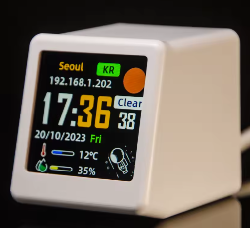
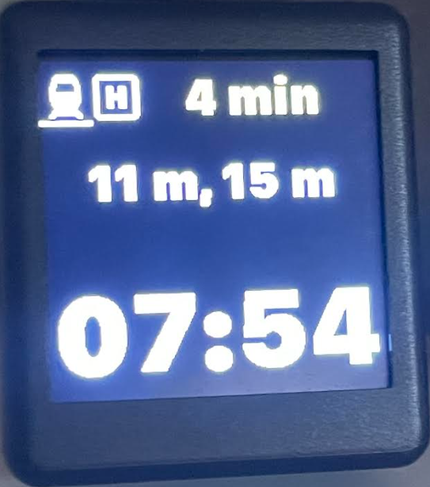

# Utiliser une MagicGeek TV et Home Assistant pour afficher les prochains trains au départ d'une gare sncf vers une autre (ici d'Enghien les Bains vers Paris Nord)

 

# Le projet:
- Afficher le nombre de minutes restantes avant les 3 prochains trains au départ de la Gare d'Enghien les Bains, vers Paris Gare du Nord
- utiliser un code couleur sur le premier train à venir:
  Vert si on a le temps ( >5 mn)
  Orange si il est temps de partir (<5 mn et >3minutes)
  Rouge si il faut se dépecher (<3mn)
- afficher que les prochains trains (l'API à tendence à conserver un temps négatif lorsque le train vien de partir...)
  A l'aide d ESPHOME


# Le materiel requis:
- Un écran GeekMagic – Station de prévision météo WiFi 
  https://fr.aliexpress.com/item/1005006159850972.html
- Home Assistant, avec une Clé API SNCF
  https://ressources.data.sncf.com/pages/accueil/
- installer Train Traveler dans Home Assitant ou l API REST
  (Les deux methodes sont décrites)

Le Code sera composé de plusieurs parties: 

# Le paramétrage de Train Traveler 
Apres avoir installer l'API dans Home Assistant , lorsque vous "ajoutez un appareil", vous devez rentrer votre Clé API
précédament obtenue aupres du site de la SNCF

Vous devez ensuite renseigner la gare de départ, dans cet exemple Enghien les Bains, ainsi que la gare d'arrivée, ici Paris Nord 

Il vous demande ensuite le nombre de prochains trains à récupérer : 4 (minimum)
le taux de rafraischissemnt est à selectionner entre 600 et 720 secondes
(ne pas mettre plus bas, au risque de vous faire ban par l API SNCF)

Il y a une option qui aurait pu etre interressante, c'est la récupération du dernier train de la journée, histroire de savoir jusqu'a quelle heure vous pouvez trainer à Paris, 
mais comme elle ne gere pas le premier train apres minuit... c est pas tres utile. Une prochaine évolution du code sera d afficher cette info (dernier train de la journée annoncé, ou premier train du lendemain avant 2h...)


vous pouvez aussi passer par l API REST de Home Assistant
# Le paramétrage de l'API Rest 

```
rest:
  - resource: https://VOTRE CLE API@api.sncf.com/v1/coverage/sncf/stop_areas/stop_area:SNCF:87271007/departures?data_freshness=realtime
    scan_interval: 600
    sensor:
      - name: "Prochains départs de Gare Du Nord"
        value_template: >
          
          
            
            {{ strptime(dep1, '%Y%m%dT%H%M%S').strftime('%Y-%m-%d %H:%M:%S') }}
          
            Pas de départ imminent
          
        json_attributes:
          - departures

  - resource: https://VOTRE CLE API8@api.sncf.com/v1/coverage/sncf/stop_areas/stop_area:SNCF:87276022/departures?data_freshness=realtime
    scan_interval: 600
    sensor:
      - name: "Prochains départs de Gare d'Enghien2"
        value_template: >
          
          
            
            {{ strptime(dep1, '%Y%m%dT%H%M%S').strftime('%Y-%m-%d %H:%M:%S') }}
          
            Pas de départ imminent
          
        json_attributes:
          - departures


  - resource: https://VOTRE CLE API@api.sncf.com/v1/coverage/sncf/stop_areas/stop_area:SNCF:87276022/departures?data_freshness=realtime
    scan_interval: 600
    sensor:
      - name: "Prochains départs de Gare d'Enghien"
        value_template: >
          
          
            
            {{ strptime(dep1, '%Y%m%dT%H%M%S').strftime('%Y-%m-%d %H:%M:%S') }}
          
            Pas de départ imminent
          
        json_attributes:
          - departures


  - resource: http://dataservice.accuweather.com/locations/v1/cities/neighbors/1107884/?apikey=T2pRStqGqoWOIznRGc8igoahABIy2dWR
    scan_interval: 600
    sensor:
      - name: "Premiere API"
        value_template: >
          
          
            
            {{ dep1 }}
          
            Aucun départ imminent
          
        json_attributes:
          - AdministrativeArea

```


# Le code ESPHOME à flasher sur la MiniTV
```
substitutions:
  devicename: smalltv
  friendlyname: SmallTV
  ip_device: 192.168.1.125
  ip_gateway: 192.168.1.254
  ip_subnet: 255.255.255.0

esphome:
  name: smalltv
  friendly_name: SmallTV

esp8266:
  board: nodemcuv2
    
external_components:
  - source:
      type: git
      url: https://github.com/rletendu/esphome.git
      ref: st7789_nobuffer_202312
    components: [st7789v]

api:
  encryption:
    key: !secret key_smallTV

ota:
  - platform: esphome
    password: !secret ota_smallTV

wifi:
  ssid: !secret wifi_ssid
  password: !secret wifi_password
  manual_ip:
    static_ip: ${ip_device}
    gateway: ${ip_gateway}
    subnet: ${ip_subnet}

  ap:
    ssid: "Cash From Cahos"
    password: "CFC_Rules_Since_69"
    
#MQTT
mqtt: #If you don't have or want MQTT Broker, Delete (mqtt and below that)
  broker: 192.168.1.5 #Use your Home Assistant local IP
  username: !secret server_username
  password: !secret mqtt_password
  client_id: "Heure des trains"
  discovery: false #If you chnnge to true Home Assistant don't discovery device only from MQTT Integration
  topic_prefix: "Heure des trains"

web_server:
  port: 80
  auth:
    username: !secret server_username
    password: !secret server_password

spi:
  clk_pin: GPIO14
  mosi_pin: GPIO13
  interface: hardware
  id: spihwd

time:
  - platform: homeassistant
    id: ha_time
    timezone: "Europe/Paris"

output:
  - platform: esp8266_pwm
    pin: GPIO05
    frequency: 80 Hz
    id: pwm_output

light:
  - platform: monochromatic
    output: pwm_output
    name: "Backlight"

# il faudra copier la font "SFCompact.ttf" dans votre répertoir ESPHOME

font:
  - file: "SFCompact.ttf"
    id: roboto
    size: 35
    glyphs: 'éèà!"%()+,-_.:°0123456789ABCDEFGHIJKLMNOPQRSTUVWXYZ abcdefghijklmnopqrstuvwxyz/'

  - file: "SFCompact.ttf"
    id: roboto_40
    size: 45
    glyphs: 'éèà!"%()+,-_.:°0123456789ABCDEFGHIJKLMNOPQRSTUVWXYZ abcdefghijklmnopqrstuvwxyz/'

  - file: "SFCompact.ttf"
    id: roboto_60
    size: 80
    glyphs: 'éèà!"%()+,-_.:°0123456789ABCDEFGHIJKLMNOPQRSTUVWXYZ abcdefghijklmnopqrstuvwxyz/'

# ici, c est le logo de ma ligne de train, a ajuster 

image:
  - file: "LigneH.png"
    id: pb_logo
    resize: 70x70
    type: RGB

# définition des couleurs seront utilisées

color:
  - id: my_red
    red: 100%
    green: 0%
    blue: 0%
  - id: my_yellow
    red: 100%
    green: 100%
    blue: 0%
  - id: my_green
    red: 0%
    green: 100%
    blue: 0%
  - id: my_blanc
    red: 100%
    green: 100%
    blue: 100%
  - id: my_black
    red: 0%
    green: 0%
    blue: 0%

# récupération des 4 sensors correspondants aux 4 prochains trains à venir
# même si nous n'en affichons que 3, nous en récuperons 4, car lorsque le
# "Next Train Minutes 1" est négatif (le train vien de partir), on aafiche 
# en premiere position "Next Train Minutes 2", en deuxieme "Next Train Minutes 3"
# et en troisieme "Next Train Minutes 4"... et lorsque "Next Train Minutes 1"
# devient à nouveau positif... on affche le 1, 2 et 3... Malin non ?
#
# le on_value, sert à forcer la mise à jour de l'écran et la remonté des données à 
# chaque changement de valeur

# le nom des sensors est à ajuster en fonction de ceux remontés dans votre intégration Train Traveler

sensor:
  - platform: homeassistant
    name: "Next Train Minutes 1"
    id: next_train_minutes_1
    entity_id: sensor.next_train_minutes_1
    icon: 'mdi:train'
    internal: true
    on_value:
      then:
        - lambda: |-
            id(disp).update();

  - platform: homeassistant
    name: "Next Train Minutes 2"
    id: next_train_minutes_2
    entity_id: sensor.next_train_minutes_2
    internal: true
    on_value:
      then:
        - lambda: |-
            id(disp).update();

  - platform: homeassistant
    name: "Next Train Minutes 3"
    id: next_train_minutes_3
    entity_id: sensor.next_train_minutes_3
    internal: true

  - platform: homeassistant
    name: "Next Train Minutes 4"
    id: next_train_minutes_4
    entity_id: sensor.next_train_minutes_4
    internal: true

# ici , on gere le rendu sur l'écran

display:
  - platform: st7789v
    model: "Custom"
    spi_id: spihwd
    height: 240
    width: 240
    offset_height: 0
    offset_width: 0
    dc_pin: GPIO00
    reset_pin: GPIO02
    eightbitcolor: true
    update_interval: 60s
    id: disp
    spi_mode: mode3
    lambda: |-
      // Récupération des valeurs des capteurs de Home Assistant
      float next1 = id(next_train_minutes_1).state;
      float next2 = id(next_train_minutes_2).state;
      float next3 = id(next_train_minutes_3).state;
      float next4 = id(next_train_minutes_4).state;
      it.image(0, 10, id(pb_logo));

      // Récupération de l'heure actuelle
      auto now = id(ha_time).now();
      if (now.is_valid()) {
        char time_str[6];
        snprintf(time_str, sizeof(time_str), "%02d:%02d", now.hour, now.minute);
        it.printf(120, 190, id(roboto_60), TextAlign::CENTER, "%s", time_str);
      }

      if (next1 > 0) {
        // Affichage de next_train_minutes_1
        char minutes_str_1[16];
        snprintf(minutes_str_1, sizeof(minutes_str_1), "%d min", (int) next1);
        if (next1 <= 2) {
          it.printf(150, 25, id(roboto), id(my_red), TextAlign::CENTER, "%s", minutes_str_1);
        } else if (next1 <= 5){
          it.printf(150, 25, id(roboto), id(my_yellow), TextAlign::CENTER, "%s", minutes_str_1);
        } else {
          it.printf(150, 25, id(roboto), id(my_green), TextAlign::CENTER, "%s", minutes_str_1);                   
        }

        // Affichage de next_train_minutes_2 et next_train_minutes_3
        if (next2 > 0 && next3 > 0) {
          char trains_str[32];
          snprintf(trains_str, sizeof(trains_str), "%d m, %d m", (int) next2, (int) next3);
          it.printf(120, 85, id(roboto), TextAlign::CENTER, "%s", trains_str);
        }
      } else {
        // Affichage de next_train_minutes_2
        char minutes_str_2[16];
        snprintf(minutes_str_2, sizeof(minutes_str_2), "%d min", (int) next2);
        if (next2 <= 2) {
          it.printf(150, 25, id(roboto), id(my_red), TextAlign::CENTER, "%s", minutes_str_2);
        } else if (next2 <= 5){
          it.printf(150, 25, id(roboto), id(my_yellow), TextAlign::CENTER, "%s", minutes_str_2);
        } else {
          it.printf(150, 25, id(roboto), id(my_green), TextAlign::CENTER, "%s", minutes_str_2);
        }
        // Affichage de next_train_minutes_3 et next_train_minutes_4
        if (next3 > 0 && next4 > 0) {
          char trains_str[32];
          snprintf(trains_str, sizeof(trains_str), "%d m, %d m", (int) next3, (int) next4);
          it.printf(120, 85, id(roboto), TextAlign::CENTER, "%s", trains_str);
        }
      }

```
